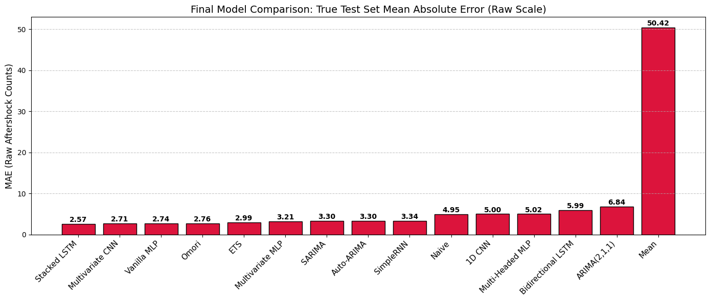
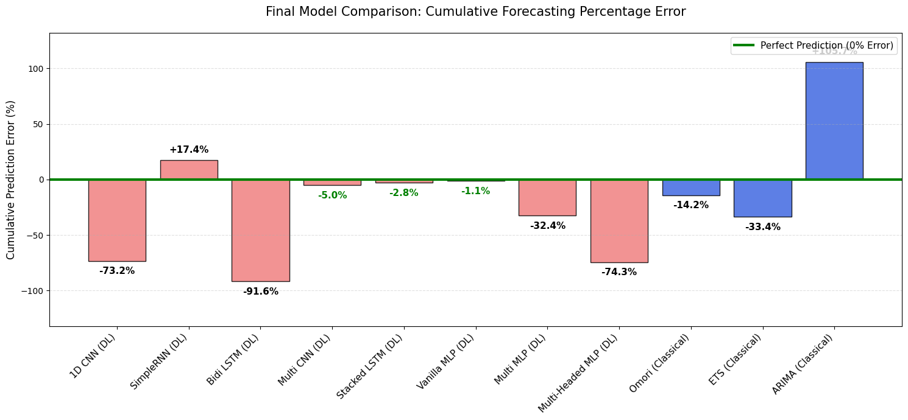

# Aftershock Decay Forecasting

This repository contains the codebase for forecasting earthquake aftershock decay following major mainshocks. It compares classical generic time-series forecasting models (ARIMA, ETS, Naive) and deep learning models (CNN, LSTM, MLP) against the physics-based domain model (Omori's law).

## Overview & Key Visualizations

The objective of this project is to model and forecast the cumulative sequence of aftershocks over time. A core finding is that while the physics-based Omori Law provides a strong baseline because it natively captures the log-linear asymptotic decay structure of seismicity, deep learning models (such as Stacked LSTMs and Multivariate CNNs) can learn complex non-linear patterns to further minimize forecasting error.

### 1. Final Model Error (MAE) Comparison
When evaluated on raw aftershock counts, deep learning architectures achieved the lowest Mean Absolute Error, outperforming generic econometric models.


### 2. Cumulative Forecast across 20-Day Horizon
Across all evaluated global earthquake sequences, the models trace the characteristic decay shape: rapid early accumulation that monotonically decays to a flat asymptote.



## Project Structure

- `data/`: Contains raw CSVs from USGS, processed sequence parquets, and model result data.
- `notebooks/`: Contains the final Jupyter Notebook report (`applied_informatics_final.ipynb`) and exported formats (HTML/PDF).
- `plots/`: Contains key visualizations extracted from the final notebook (e.g., MAE comparisons and forecast horizons).
- `requirements.txt`: Python package dependencies.

## Installation & Setup

**IMPORTANT**: Always make sure to use a virtual environment (`venv`) or some kind of package manager when running files with dependencies. Activate and use a `venv` before running any Python file in this project.

### For Windows

```bash
# 1. Create a virtual environment
python -m venv venv

# 2. Activate the virtual environment
venv\Scripts\activate

# 3. Install dependencies
pip install -r requirements.txt
```

### For macOS / Linux

```bash
# 1. Create a virtual environment
python3 -m venv venv

# 2. Activate the virtual environment
source venv/bin/activate

# 3. Install dependencies
pip3 install -r requirements.txt
```

## Usage

The data pipeline, modeling sequence, and final report are contained within `notebooks/applied_informatics_final.ipynb`.

1. Open `notebooks/applied_informatics_final.ipynb` in Jupyter Notebook or JupyterLab.
2. Run the cells sequentially to reproduce the data fetching, sequencing, rolling-origin forecasts, and visualizations.
   
The notebook also contains the final detailed report, extended visualizations, and statistical testing of model performance.