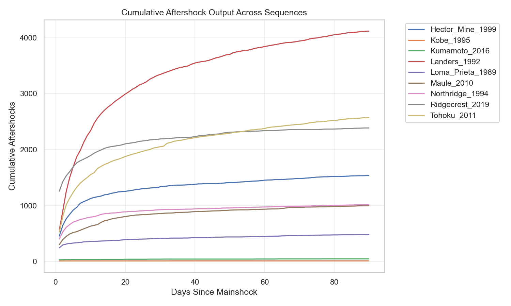
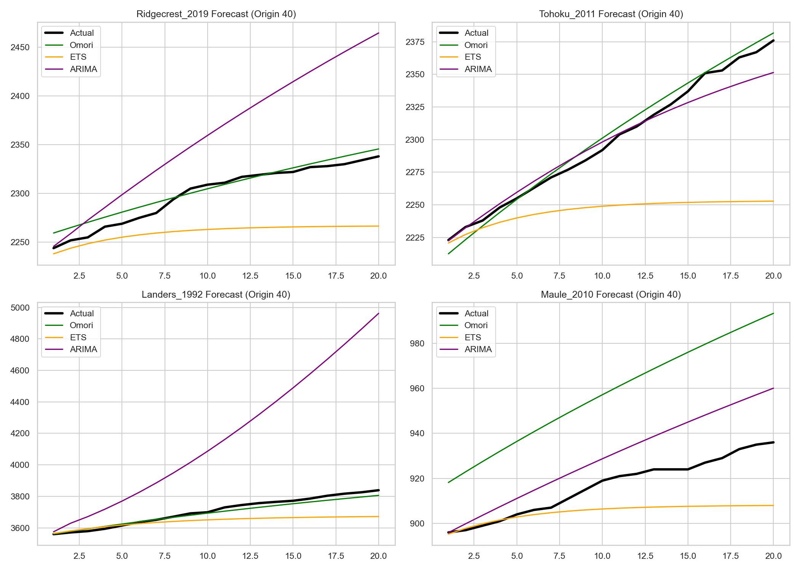

# Earthquake Aftershock Forecasting

This repository contains the codebase for forecasting earthquake aftershock decay following major mainshocks. It compares classical generic time-series forecasting models (ARIMA, ETS, Naive) against the physics-based domain model (Omori's law).

## Overview & Key Visualizations

The objective of this project is to model and forecast the cumulative sequence of aftershocks over time. A core finding is that the physics-based **Omori Law** vastly outperforms generic econometric models because it natively captures the log-linear asymptotic decay structure of seismicity.

### 1. The Cumulative Decay Signature
Across all evaluated global earthquake sequences (e.g., Ridgecrest, Tohoku, Landers), aftershocks exhibit a universally similar shape: rapid early accumulation that monotonically decays to a flat asymptote.


### 2. Model Forecasting Comparison
When evaluating rolling-origin forecasts over a multi-day horizon, standard linear models like ARIMA systematically over-extrapolate the trend. Exponential Smoothing (ETS) with a damped trend performs better, but Omori provides the tightest fit.


## Project Structure

- `data/`: Contains raw CSVs from USGS, processed sequence parquets, and model result data.
- `notebooks/`: Contains Jupyter Notebooks, including the main `capstone_main.ipynb` which presents the final report and evaluation.
- `plots/`: Contains generated visualizations used in the report.
- `scripts/`: Contains Python scripts for the data pipeline:
  - `fetch_aftershocks.py`: Downloads event data from the USGS ComCat API.
  - `build_sequences.py`: Aggregates events into daily and hourly time-series sequences.
  - `run_models.py`: Runs rolling-origin forecasts using AR, MA, ARIMA, ETS, and Omori models.

## Installation & Setup

**IMPORTANT**: Always make sure to use a virtual environment (`venv`) or some kind of package manager when running files with dependencies. Activate and use a `venv` before running any Python file in this project.

```bash
# 1. Create a virtual environment
python -m venv venv

# 2. Activate the virtual environment
# On Windows:
venv\Scripts\activate
# On macOS/Linux:
source venv/bin/activate

# 3. Install dependencies
pip install pandas numpy pyarrow requests statsmodels pmdarima scikit-learn scipy jupyter matplotlib seaborn
```

## Usage

Run the pipeline scripts in the following order:

1. **Fetch Data:**
   ```bash
   python scripts/fetch_aftershocks.py
   ```
2. **Build Sequences:**
   ```bash
   python scripts/build_sequences.py
   ```
3. **Run Models:**
   ```bash
   python scripts/run_models.py
   ```
   
After running the pipeline, you can open `notebooks/capstone_main.ipynb` in Jupyter (or view the generated `capstone_main.html`) to see the final detailed report, extended visualizations, and statistical hypothesis testing (Wilcoxon signed-rank tests) of model performance.